# Focus Guard

App desktop locale che usa la webcam per capire quando lo sguardo esce da
un'area definita (lo schermo, o una zona della scrivania). Dopo un ritardo
configurabile mostra un banner con un'immagine casuale e fa partire una
musica in loop. Entrambi si fermano appena lo sguardo rientra.

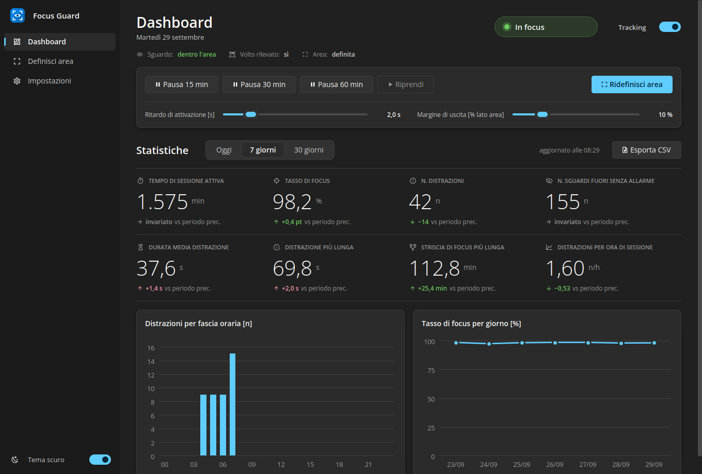

## Privacy

- Tutta l'elaborazione avviene **in locale**: OpenCV legge la webcam e il
  modello MediaPipe gira sulla tua macchina.
- I frame restano solo in memoria, dentro il loop di cattura
  (`focus_guard/vision/tracker.py`), e vengono scartati subito. **Nessun frame
  viene salvato su disco né inviato in rete.** Fuori dal tracker escono solo
  numeri (posizione dell'iride e angoli della testa). Solo mentre è aperta
  la finestra *Definisci area* esce anche una copia ridotta del frame per
  l'anteprima a schermo, anch'essa solo in memoria.
- Il **registro eventi** (`data/focus_guard.db`, SQLite locale) contiene solo
  tipo di evento, inizio e fine: nessuna immagine, nessun landmark.
- Il test `tests/test_privacy.py` fallisce se nel pacchetto compaiono
  scritture di immagini/video o import di librerie di rete.
- L'unica operazione di rete è lo script esplicito che scarica **una volta**
  il file del modello; non invia alcun dato.
- In **pausa** o a **tracking fermo** la webcam viene rilasciata del tutto: il
  LED si spegne.

## Avvio rapido con doppio click

Requisiti: Python 3.10–3.12 (le versioni supportate da MediaPipe), una webcam.
Su Windows, durante l'installazione di Python spunta **"Add python.exe to PATH"**.

```bash
git clone https://github.com/riccardocannone98/focus.git
```

Poi, nella cartella `focus`:

- **macOS**: doppio click su **`avvia.command`**. La prima volta macOS può
  bloccarlo perché non è firmato: clic destro → *Apri* → *Apri*. Se compare
  "permesso negato", apri il Terminale nella cartella ed esegui una volta
  `chmod +x avvia.command`.
- **Windows**: doppio click su **`avvia.bat`**. Se SmartScreen avvisa,
  scegli *Ulteriori informazioni* → *Esegui comunque*.

Al **primo avvio** lo script crea l'ambiente `.venv`, installa i
`requirements.txt` e scarica il modello MediaPipe. Servono alcuni minuti e la
connessione internet. Dai successivi avvii attiva `.venv` e lancia subito
`python -m focus_guard`. La finestra del terminale resta aperta mentre l'app
gira, perché mostra i log: chiuderla chiude anche Focus Guard (in alternativa
usa *Esci* dalla tray). In caso di errore la finestra resta aperta con il
messaggio.

Gli script passano eventuali argomenti all'app, ad esempio
`./avvia.command --define-area`.

## Installazione manuale

```bash
python -m venv .venv
# Windows: .venv\Scripts\activate    macOS/Linux: source .venv/bin/activate
pip install -r requirements.txt
python scripts/download_model.py      # scarica models/face_landmarker.task (~3,7 MB)
```

Metti i tuoi contenuti in:

- `assets/images/`: png, jpg, jpeg, gif, bmp, webp (ne viene scelta una a caso a ogni attivazione)
- `assets/music/`: mp3, ogg, wav, flac (un brano a caso, in loop)

Le cartelle vengono rilette a ogni attivazione, quindi puoi aggiungere file
senza riavviare. Se una cartella è vuota il banner mostra solo il testo, o
non parte la musica.

> Linux: MediaPipe richiede `libegl1` e `libgles2`; la tray richiede un
> desktop con area di notifica (su GNOME serve l'estensione AppIndicator).

## Uso

```bash
python -m focus_guard                 # avvio normale: dashboard + tray
python -m focus_guard --define-area   # apre subito la definizione dell'area
python -m focus_guard --no-dashboard  # parte solo nella tray
python -m focus_guard -v              # log dettagliati
```

All'avvio si apre la **dashboard** e parte il tracking. Chiudendo la
dashboard l'app resta attiva nella **system tray**: click sull'icona o
*Apri dashboard* per riaprirla, *Esci* per chiudere davvero.

La barra laterale porta a **Dashboard**, **Definisci area** e
**Impostazioni**. In fondo alla barra c'è l'interruttore **Tema scuro**: il
tema predefinito è scuro e la scelta viene salvata in `config.json`.

### Definire l'area di lavoro

Se non c'è ancora un'area (o premi *Ridefinisci area*) si apre la finestra
**Definisci area**:

- a sinistra l'**anteprima della webcam**, specchiata, con le iridi
  evidenziate in azzurro;
- a destra la **mappa dello sguardo**: il punto mostra in tempo reale dove
  stai guardando (destra = destra, giù = giù).

1. **Registrazione libera**: premi *Avvia registrazione* e per 20 s
   (`recording_seconds`) guarda con naturalezza la tua zona di lavoro:
   schermo, tastiera, appunti. I campioni vengono raccolti (battiti di ciglia
   esclusi), gli outlier scartati con i percentili 5–95
   (`outlier_percentiles`), e il rettangolo compare sulla mappa.
2. **Ritocco**: trascina bordi e angoli (o l'interno, per spostarlo). Il punto
   è **verde** dentro l'area e **rosso** fuori. Il tratteggio mostra il
   margine di uscita attuale.
3. **Salva** scrive l'area in `config.json`; **Ripeti registrazione** ricomincia;
   **Annulla** (o ESC) lascia l'area precedente.

Se avevi la vecchia calibrazione a 4 angoli, al primo avvio viene convertita
automaticamente nel rettangolo equivalente.

Il tempo passato nella finestra *Definisci area* viene registrato come pausa
e non conta nei KPI.

### Dashboard e pannello di controllo

**Controllo**

- indicatore di stato ben visibile: **In focus** (verde), **Sguardo fuori…**
  (giallo, prima del ritardo), **Distratto** (rosso), **In pausa** con l'ora di
  ripresa, **Fermo** (grigio); sotto, sguardo dentro/fuori area, volto
  rilevato sì/no e area definita;
- interruttore a levetta **Tracking** per avviare o fermare: fermo = sessione
  chiusa e webcam spenta;
- *Pausa 15 / 30 / 60 min* (riprende da sola) e *Riprendi*;
- *Ridefinisci area*;
- cursori **Ritardo di attivazione [s]** (0,5–10) e **Margine di uscita
  [% lato area]** (0–50): hanno effetto subito e vengono salvati in
  `config.json`.

**Statistiche**: filtro *Oggi / 7 giorni / 30 giorni*, aggiornamento
automatico ogni 30 s. Ogni KPI mostra la **variazione rispetto al periodo
precedente**: stesso periodo spostato indietro della sua durata (oggi → ieri
dalla mezzanotte alla stessa ora; 7 giorni → i 7 giorni prima). La freccia è
**verde se l'indicatore migliora** e rossa se peggiora: meno distrazioni è
verde anche se il numero scende.

| KPI | Definizione |
|---|---|
| Tempo di sessione attiva [min] | tempo con tracking avviato, pause escluse |
| Tasso di focus [%] | (tempo attivo − tempo fuori area) / tempo attivo |
| N. distrazioni [n] | uscite che hanno fatto scattare l'allarme |
| N. sguardi fuori senza allarme [n] | uscite rientrate prima del ritardo di attivazione |
| Durata media distrazione [s] | media di (rientro − uscita dello sguardo) |
| Distrazione più lunga [s] | massimo della stessa durata |
| Striscia di focus più lunga [min] | tratto attivo continuo più lungo senza distrazioni (gli sguardi brevi sono tollerati; le pause interrompono) |
| Distrazioni per ora di sessione [n/h] | N. distrazioni / ore di sessione attiva |

Il tempo fuori area comprende sia le distrazioni sia gli sguardi brevi.
Gli episodi vengono contati nel periodo in cui iniziano.

Grafici: **distrazioni per fascia oraria [n]** e **tasso di focus per
giorno [%]**, con tooltip al passaggio del mouse.

**Esporta CSV** salva gli eventi del periodo selezionato (id, tipo, inizio,
fine, durata [s]) in formato adatto a Excel in italiano: separatore `;`,
decimali con la virgola, UTF-8 con BOM.

### Tray e banner

L'icona della tray cambia per stato: un badge con colore **e** simbolo
(✓ in focus, ••• sguardo fuori, ! distratto, ‖ in pausa, ■ fermo, + area da
definire, × errore webcam). Il menu offre *Apri dashboard*, *Pausa/Riprendi*,
*Ridefinisci area* ed *Esci*.

Il banner compare e scompare **con dissolvenza**. Mostra uno sfondo oscurato
morbido, la foto in una card arrotondata, un **messaggio ironico** a rotazione
(dieci frasi, mai due volte di fila) e il **tempo trascorso fuori area**, che
scorre. Il testo di `banner_text` compare come sottotitolo. Il banner è
**trasparente a mouse e tastiera**: anche se il rilevamento sbagliasse, non
blocca il lavoro.

## Aspetto

Stile Fluent (Windows 11) con colore principale azzurro Windows, tema scuro
e chiaro.

- **Design system** in un unico file, `focus_guard/ui/theme.py`: palette dei
  due temi come costanti (nessun colore scritto altrove), spaziature a
  multipli di 8 px, raggi degli angoli, rampa tipografica e foglio di stile
  globale.
- **Carattere**: Segoe UI Variable (Display per i titoli, Text per il resto),
  con Segoe UI come ripiego. Su sistemi senza Segoe si usano Open Sans o Noto
  Sans.
- **Icone** vettoriali Material Design tramite
  [qtawesome](https://github.com/spyder-ide/qtawesome): 2,6 MB, solo Python,
  nessuna dipendenza nativa. È l'unica nuova dipendenza. Icona dell'app e
  icone della tray sono disegnate in vettoriale dal codice.
- **KPI** in stile minimale (numeri grandi e leggeri separati da filetti);
  card con angoli arrotondati e ombre leggere per controlli, grafici e
  impostazioni; grafici matplotlib con colori, font e sfondo del tema.

| | Tema scuro | Tema chiaro |
|---|---|---|
| Dashboard |  | 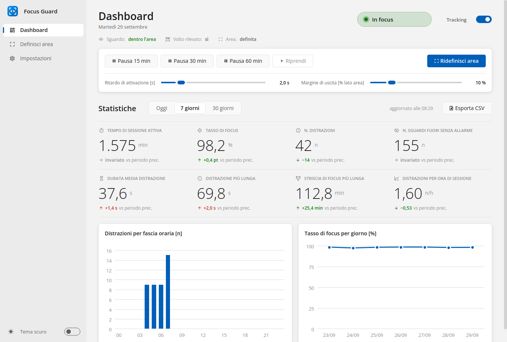 |
| Dashboard, distratto | 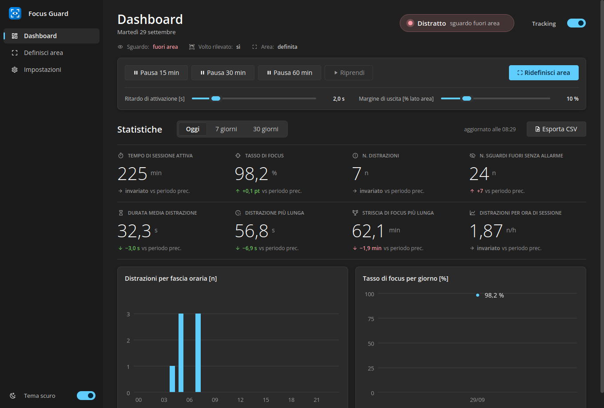 | 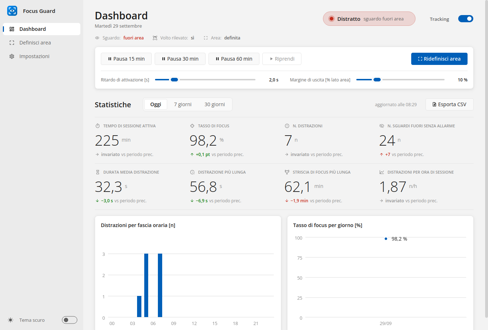 |
| Impostazioni | 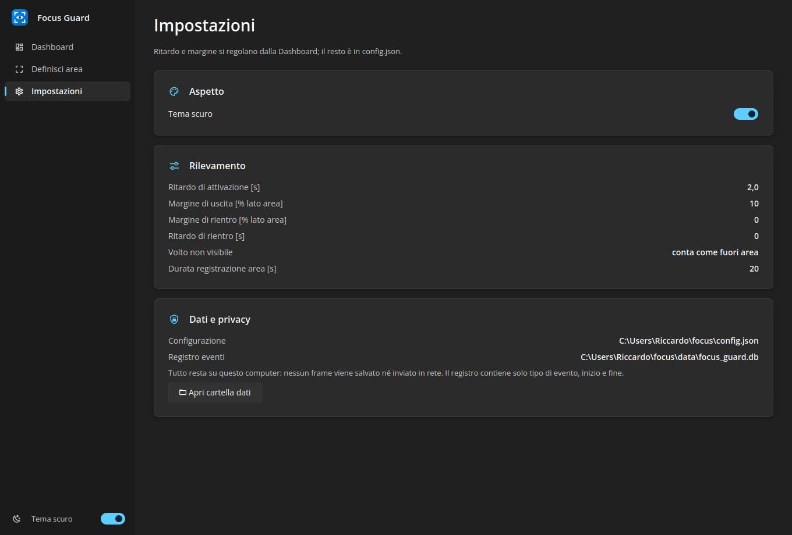 | 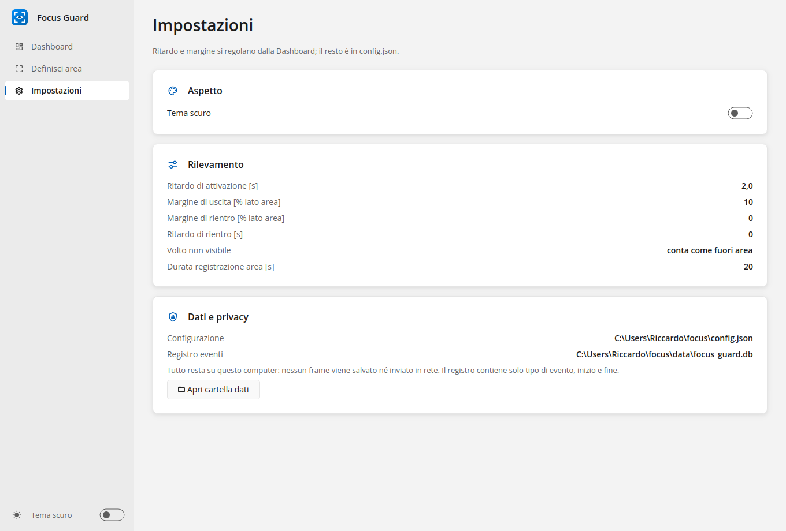 |
| Definisci area | 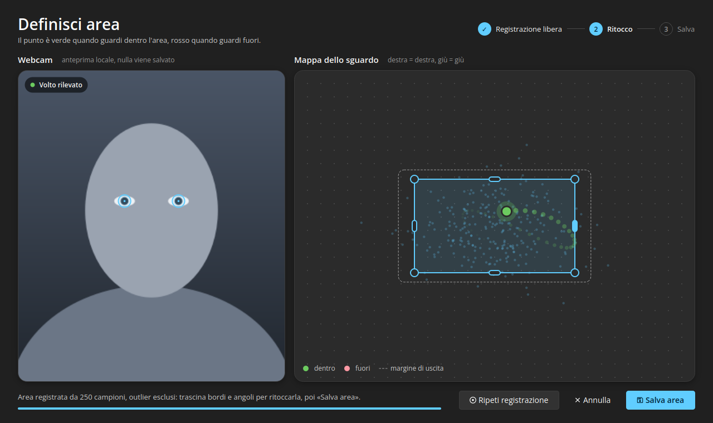 | 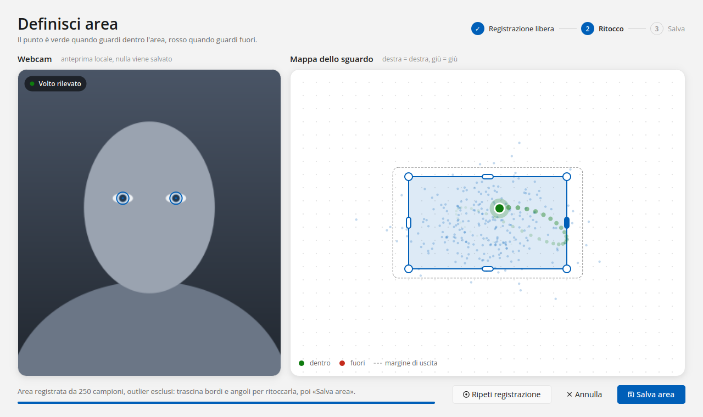 |
| Banner | 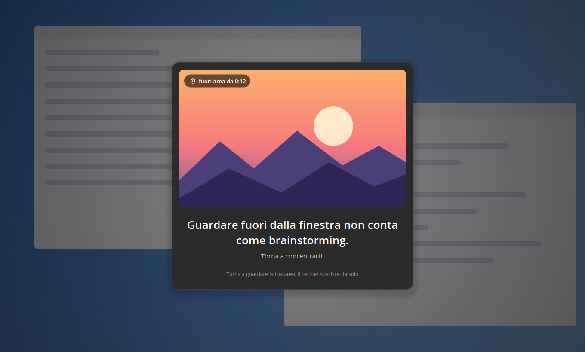 | 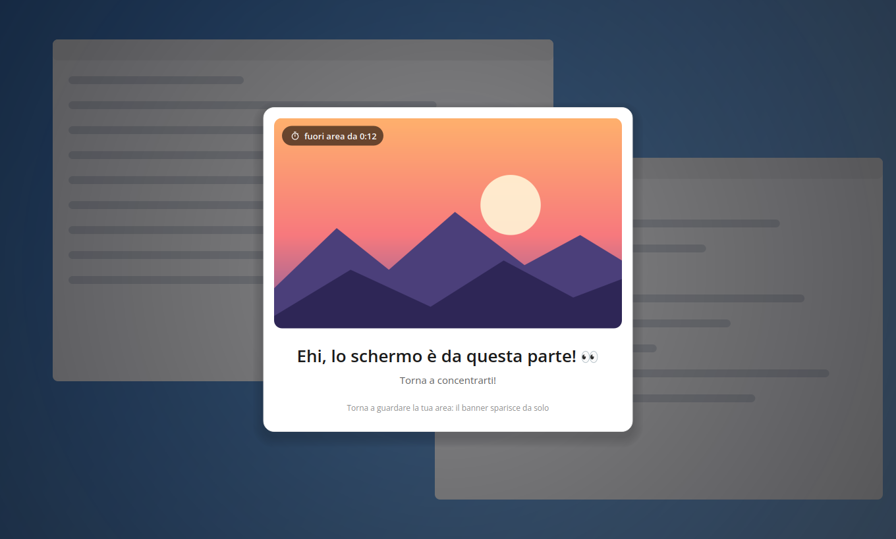 |

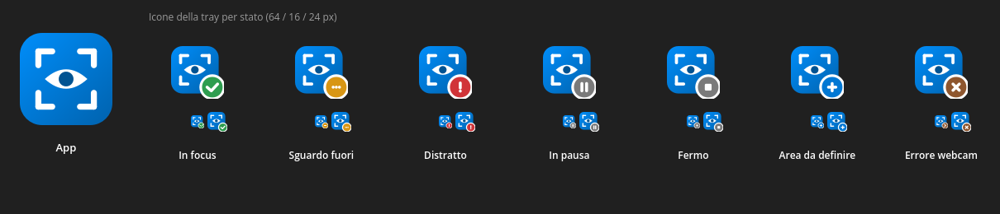

Gli screenshot sono generati in un ambiente Linux senza Segoe UI (al suo
posto c'è Open Sans) e con dati, foto e webcam di esempio.

## Configurazione (`config.json`)

Il file viene creato al primo avvio. Ritardo e margine si cambiano dalla
dashboard; le altre chiavi valgono al riavvio.

| Chiave | Default | Significato |
|---|---|---|
| `exit_margin` | `0.10` | Quanto oltre il bordo deve andare lo sguardo per contare come "fuori" (frazione del lato dell'area) |
| `reentry_margin` | `0.0` | Soglia di rientro; deve essere ≤ `exit_margin`. Valori negativi obbligano a rientrare più a fondo |
| `activation_delay_s` | `2.0` | Secondi continuativi fuori area prima dell'allarme |
| `reentry_delay_s` | `0.0` | Secondi dentro l'area prima di spegnere (0 = stop immediato) |
| `face_lost_counts_as_out` | `true` | Volto non visibile (ti alzi, ti giri) = fuori area |
| `recording_seconds` | `20.0` | Durata della registrazione libera |
| `outlier_percentiles` | `[5.0, 95.0]` | Percentili usati per costruire il rettangolo |
| `head_weight` | `0.007` | Peso della rotazione della testa (per grado) rispetto all'iride; `0` = solo occhi |
| `smoothing_alpha` | `0.35` | Smoothing esponenziale (1 = nessuno) |
| `blink_threshold` | `0.5` | Sopra questo score l'occhio è considerato chiuso e il campione ignorato |
| `camera_index`, `frame_width`, `frame_height`, `target_fps` | `0`, `640`, `480`, `15` | Webcam |
| `images_dir`, `music_dir` | `assets/...` | Cartelle dei contenuti (relative al progetto o assolute) |
| `music_volume`, `overlay_opacity` | `0.6`, `0.6` | 0–1 |
| `banner_text` | `Torna a concentrarti!` | Sottotitolo del banner (il titolo è un messaggio ironico a rotazione) |
| `theme` | `dark` | Tema dell'interfaccia: `dark` o `light` (interruttore nella dashboard) |
| `database_path` | `data/focus_guard.db` | Registro eventi SQLite |
| `area` | `null` | Scritta dalla finestra *Definisci area*: non modificarla a mano |

### Isteresi

La posizione dello sguardo viene normalizzata sul rettangolo dell'area:
`(0,0)` è l'angolo in alto a sinistra, `(1,1)` quello in basso a destra. Da
qui si calcola una distanza con segno dal bordo: positiva fuori, negativa
dentro. I margini sono quindi frazioni del lato dell'area.

```
FOCUSED ──d > exit_margin──▶ LEAVING ──per activation_delay_s──▶ DISTRACTED  (banner + musica)
   ▲                            │                                      │
   └──────d ≤ exit_margin───────┘                         d ≤ reentry_margin
   ▲                                                                   ▼
   └───────────per reentry_delay_s───────────── RETURNING ◀────────────┘
                                                    │ d > reentry_margin → DISTRACTED
```

Con `reentry_margin < exit_margin` lo sguardo che oscilla sul bordo non fa
lampeggiare il banner. Un episodio *LEAVING → FOCUSED* è uno **sguardo fuori**;
se passa da *DISTRACTED* è una **distrazione**.

## Come si stima lo sguardo

Dai 478 landmark di MediaPipe si prende la posizione del centro dell'iride
rispetto agli angoli dell'occhio, normalizzata sulla larghezza dell'occhio
e indipendente dall'inclinazione della testa, e la si media sui due occhi.
Il punto sulla mappa è:

```
gx = −(iride_x + head_weight · sign_x · yaw)     (ribaltato: destra = destra)
gy =   iride_y + head_weight · sign_y · pitch
```

Il verso con cui la testa si somma all'iride (`sign_x`, `sign_y`) viene
stimato dalla correlazione tra iride e testa nei campioni registrati. Se la
correlazione è debole (|r| < 0,3, per esempio a testa ferma) resta il verso
dell'area precedente. I battiti di ciglia (blendshape `eyeBlink*`) vengono
ignorati.

Limiti noti: la precisione verticale è inferiore a quella orizzontale, e se
ti sposti molto (non ruoti, ma trasli) rispetto a quando hai definito
l'area conviene ridefinirla. Per aree piccole alza il margine di uscita.

## Struttura

```
focus_guard/
  config.py            Config + load/save config.json (scrittura atomica)
  logic/area.py        mappa dello sguardo, rettangolo da percentili, trascinamento   (puro)
  logic/features.py    landmark → iride/testa, cerchi iride, smoothing, blink          (puro)
  logic/focus.py       macchina a stati soglia/ritardo/isteresi                        (puro)
  logic/episodes.py    sguardi fuori e distrazioni dalle transizioni di stato          (puro)
  stats/store.py       registro eventi SQLite + esportazione CSV
  stats/kpi.py         aritmetica sugli intervalli e KPI                               (puro)
  vision/tracker.py    thread webcam + MediaPipe (frame solo in RAM)
  media.py             immagine casuale, MusicPlayer (pygame.mixer)
  ui/theme.py          design system: palette scuro/chiaro, spaziature, font, stile globale
  ui/widgets.py        componenti: card, interruttore, indicatore di stato, KPI, barra laterale
  ui/icons.py          icona dell'app e icone della tray per stato (vettoriali)
  ui/messages.py       messaggi ironici del banner e formato del tempo fuori area
  ui/area_window.py    anteprima webcam + mappa dello sguardo + ritocco
  ui/dashboard.py      barra laterale, pannello di controllo, KPI, impostazioni, esportazione
  ui/charts.py         grafici matplotlib coerenti con il tema
  ui/overlay.py        banner con dissolvenza, sempre in primo piano, click-through
  ui/tray.py           icona e menu nella tray
  app.py               controller
  __main__.py          CLI
scripts/download_model.py
tests/
avvia.command         avvio con doppio click su macOS
avvia.bat             avvio con doppio click su Windows
```

## Test

```bash
pip install -r requirements-dev.txt
python -m pytest
```

I test coprono:

- soglie, ritardi e isteresi (`test_focus.py`) ed episodi (`test_episodes.py`);
- l'area: percentili, outlier, stima del verso della testa, migrazione,
  trascinamento (`test_area.py`);
- KPI e aritmetica sugli intervalli, compresi pause, periodi e mezzanotte
  (`test_kpi.py`), e il registro SQLite con l'esportazione CSV (`test_store.py`);
- feature da landmark sintetici, config, media e privacy;
- interfaccia (`test_ui.py`): palette dei due temi, griglia a 8 px, cambio
  tema salvato in config, messaggi a rotazione, banner che si nasconde subito
  mentre la dissolvenza continua a parte, stati dell'indicatore, variazioni
  KPI rispetto al periodo precedente, icone della tray diverse per stato.

`test_app.py` prova i flussi completi con webcam, audio e orologi finti, usando
Qt in modalità `offscreen`: definizione area → allarme → rientro, pause a
tempo, stop, cursori, trascinamento con il mouse, KPI ed esportazione.
